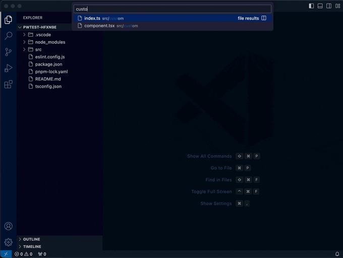

# eslint-plugin-codegen

An eslint plugin for inline codegen. Auto-fixes out of sync code, with presets for barrels, jsdoc to markdown and more.

[](https://github.com/mmkal/eslint-plugin-codegen/actions/workflows/ci.yml)


## Motivation

Sometimes the same information is useful in multiple places - for example, jsdoc comments in code can double as markdown-formatted documentation for a library.

This allows generating code in a project using eslint, without having to incorporate any extra build tools, either for the codegen itself, or to validate that the generated code is up to date. So references to other parts of the project will always stay up to date - and your existing CI tools can enforce this just by running eslint.

Here's an example of it being used along with VSCode's eslint plugin, with auto-fix-on-save:


## Contents

<!-- codegen:start {preset: markdownTOC, minDepth: 2, maxDepth: 4} -->
- [Motivation](#motivation)
- [Contents](#contents)
- [How to use](#how-to-use)
   - [Setup](#setup)
      - [Usage with eslint-plugin-markdown](#usage-with-eslint-plugin-markdown)
   - [Presets](#presets)
      - [custom](#custom)
      - [copy](#copy)
      - [excludeLines](#excludelines)
      - [onlyIfExists](#onlyifexists)
      - [comparison](#comparison)
      - [barrel](#barrel)
      - [markdownFromJsdoc](#markdownfromjsdoc)
      - [monorepoTOC](#monorepotoc)
      - [markdownFromJsdoc](#markdownfromjsdoc-1)
      - [markdownTOC](#markdowntoc)
      - [markdownFromTests](#markdownfromtests)
      - [labeler](#labeler)
   - [Customisation](#customisation)
<!-- codegen:end -->

## How to use

<details>
<summary>Caveat</summary>

Before you use this, note that it's still in v0. That means:

1. Breaking changes might happen. Presets might be renamed, or have their options changed. The documentation should stay up to date though, since that's partly the point of the project.
1. There are missing features, or incompletely-implemented ones. For example, `markdownFromJsdoc` only works with `export const ...` style exports. Currently most of the features implemented are ones that are specifically needed for this git repo.
1. There might be bugs. The project is in active development - [raise an issue](https://github.com/mmkal/ts/issues) if you find one!

</details>

### Setup

In an eslint-enabled project, install with

```bash
npm install --save-dev eslint-plugin-codegen
```

or

```bash
yarn add --dev eslint-plugin-codegen
```

Then add the plugin and rule to your eslint config, for example in `eslintrc.js`:

```js
module.exports = {
  //...
  plugins: [
    // ...
    'codegen',
  ],
  rules: {
    // ...
    'codegen/codegen': 'error',
  },
}
```

You can use the rule by running eslint in a standard way, with something like this in an npm script: `eslint --ext .ts,.js,.md .`

In vscode, if using the eslint plugin, you may need to tell it to validate markdown files in your repo's `.vscode/settings.json` file (see [this repo for an example](../../.vscode/settings.json)):

```json
{
  "eslint.validate": ["markdown", "javascript", "typescript"],
  "editor.codeActionsOnSave": {
    "source.fixAll.eslint": true
  }
}
```

To trigger the rule, add a comment line to a source file.

In markdown:

`<!-- codegen:start {{ OPTIONS }} -->`

In typescript/javascript:

`// codegen:start {{ OPTIONS }}`

Where `{{ OPTIONS }}` are an inline object in the format:

`{preset: presetName, key1: value1, key2: value2}`

Where `key1` and `key2` are options passed to the codegen preset. yaml is used to parse the object, So any valid yaml that fits on one line can be passed as options. In practise, the one-line restriction means using [yaml's "flow style"](https://yaml.org/spec/1.2/spec.html#id2759963) for collections.

See below for documentation. This repo also has [lots of usage examples](https://github.com/mmkal/ts/search?q=%22codegen%3Astart%22&unscoped_q=%22codegen%3Astart%22).

#### Usage with eslint-plugin-markdown

This plugin uses an [ESLint processor](https://eslint.org/docs/latest/extend/custom-processors) to handle markdown and YAML files. ESLint [only allows one processor per file type](https://github.com/eslint/eslint/issues/17724), so the processor from this plugin is designed to be compatible with `eslint-plugin-markdown`. But to use both plugins, you need to use the process for `eslint-plugin-codegen`, not `eslint-plugin-markdown`. You can do this by adding the recommended config for `eslint-plugin-codegen` second, e.g.

```js
module.exports = {
  plugins: ['markdown', 'codegen'],
  extends: ['plugin:markdown/recommended', 'plugin:codegen/recommended'],
}
```

Or specify the processor explicitly - when you switch to [flat config this will be required](https://eslint.org/docs/latest/extend/custom-processors#specifying-processor-in-config-files):

```js
module.exports = {
  // 1. Add the plugin.
  plugins: ['markdown'],
  overrides: [
    {
      // 2. Enable the Markdown processor for all .md files.
      files: ['**/*.md'],
      processor: 'codegen/processor', // NOT 'markdown/markdown'
    },
  ],
}
```

### Presets

<!-- codegen:start {preset: markdownFromJsdoc, source: src/presets/custom.ts, export: custom} -->
#### [custom](./src/presets/custom.ts#L62)

Define your own codegen function, which will receive all options specified. Import the `Preset` type from this library to define a strongly-typed preset function:

##### Example

```typescript
export const jsonPrinter: import('eslint-plugin-codegen').Preset<{myCustomProp: string}> = ({meta, options}) => {
  const components = meta.glob('**\/*.tsx') // uses 'globSync' from glob package
  const json = JSON.stringify({filename: meta.filename, customProp: options.myCustomProp, components}, null, 2)
  return `export default ${json}`
}

// codegen:start {export: jsonPrinter}
```

This can be used in other files by specifying the `source` option like:


`<!-- codegen:start {source: ./lib/my-custom-preset.js, export: jsonPrinter, myCustomProp: hello}`

<br /> Note that some helpers passed via `dependencies`, such as `glob`, `fs`, `path`, `child_process`, `lodash`, `jsYaml`, `dedent`, and `readPkgUp`, corresponding to those node modules respectively. These can be useful to allow access to those libraries without them being production dependencies. This also allows your lint process to use these node-only dependencies, even in a file that is not run in node - only the calls would be included in any bundled output, not the dependencies themselves.

##### Params

|name   |description                                                                                                                                                                                              |
|-------|---------------------------------------------------------------------------------------------------------------------------------------------------------------------------------------------------------|
|source |Relative path to the module containing the custom preset. Default: the file being linted.                                                                                                                |
|export |The name of the export. If omitted, the module's default export should be a preset function.                                                                                                             |
|require|A module to load before `source`. If not set, defaults to `tsx/cjs` or `ts-node/register/transpile-only` for typescript sources.                                                                         |
|dev    |Set to `true` to clear the require cache for `source` before loading. Allows editing the function without requiring an IDE reload. Default false if the `CI` enviornment variable is set, true otherwise.|
<!-- codegen:end -->

##### Caching

Sometimes, you may want to write a custom function that takes a long time to run. To avoid having to wait for it to run every time you lint, you can set the `dev` option to `true`. This will clear the require cache for the custom function, so it will be run fresh each time.

```typescript
export const longRunningFunction: import('eslint-plugin-codegen').Preset = ({cache}) => {
  const result = cache({maxAge: '1 year'}, () => {
    // do something that takes a long time to run, but doesn't need to run too often
  })
  return result
}
// codegen:start {preset: custom, export: longRunningFunction}
```

You can use some helpers that are passed to the preset function:

```typescript
export const secretaryGeneralLogStatement: import('eslint-plugin-codegen').Preset = ({cache, dependencies}) => {
  const result = cache({maxAge: '1 year'}, () => {
    const res = dependencies.fetchSync('https://www.un.org/sg')
    const secretaryGeneral = (/Secretary-General ([A-Z].+?) [a-z]/.exec(res.text))?.[1]
    return `console.log('The UN Secretary-General is ${secretaryGeneral}')`
  })
  return result
}

// codegen:start {preset: custom, export: secretaryGeneralLogStatement}
```

This will transform to something like:

```typescript
export const secretaryGeneralLogStatement: import('eslint-plugin-codegen').Preset = ({cache, dependencies}) => {
  return cache({maxAge: '4 weeks'}, () => {
    const res = dependencies.fetchSync('https://en.wikipedia.org/wiki/Secretary-General_of_the_United_Nations')
    const $ = dependencies.cheerio.load(res.text)
    const incumbent = $('.infobox div:contains("Incumbent")')
    const secretaryGeneral = incumbent.find('a').text()
    return `console.log('The UN Secretary-General is ${secretaryGeneral}')`
  })
  return result
}

// codegen:start {preset: custom, export: secretaryGeneralLogStatement}
// codegen:hash {input: 4119892f2e6eaf56ae5c346de91be718, output: eed0d07c81b82bff1d3e4751073b0112, timestamp: 2025-03-05T18:58:13.921Z}
console.log('The UN Secretary-General is António Guterres')
// codegen:end
```

It will not re-run unless the input has changed, the output hash doesn't match, or until 1 year after the recorded timestamp. "The input" is a hash of the following:

- the filename the directive appears in
- the source code _excluding_ any existing content between the `codegen:start` and `codegen:end` directives
- the options passed to the preset

The output (i.e. the generated code between the start and end directives) is also hashed and written to the hash directive.

If the the generated code doesn't match the output hash, the generator function will re-run.

This means that if you change the filename, or any of the source code, it will re-run. You can control this behaviour when defining your generator function:

```ts
export const secretaryGeneralLogStatement: import('eslint-plugin-codegen').Preset =
  ({cache, dependencies}) => {
    return cache({maxAge: '4 weeks'}, () => {
      const res = dependencies.fetchSync(
        'https://en.wikipedia.org/wiki/Secretary-General_of_the_United_Nations',
      )
      const $ = dependencies.cheerio.load(res.text)
      const incumbent = $('.infobox div:contains("Incumbent")')
      const secretaryGeneral = incumbent.find('a').text()
      return `console.log('The UN Secretary-General is ${secretaryGeneral}')`
    })
  }

// codegen:start {preset: custom, export: secretaryGeneralLogStatement}
// codegen:hash {input: 4119892f2e6eaf56ae5c346de91be718, output: eed0d07c81b82bff1d3e4751073b0112, timestamp: 2025-03-05T18:58:13.921Z}
console.log('The UN Secretary-General is António Guterres')
// codegen:end
```

The helpers that are provided to the generator function via the `dependencies` prop are listed below. You can use all of them in a type-safe way in your generator function, without having to add them as dependencies or even devDependencies:

- `fs`: https://nodejs.org/api/fs.html
- `path`: https://nodejs.org/api/path.html
- `child_process`: https://nodejs.org/api/child_process.html
- `lodash`: https://npmjs.com/package/lodash
- `jsYaml`: https://npmjs.com/package/js-yaml
- `dedent`: https://npmjs.com/package/dedent
- `glob`: https://npmjs.com/package/glob
- `readPkgUp`: https://npmjs.com/package/read-pkg-up
- `cheerio`: https://npmjs.com/package/cheerio
- `makeSynchronous`: A function for making functions synchronous by running them in a subprocess. See [the code](./src/make-synchronous.ts) for more details. It's a simplified version of [this](https://github.com/sindresorhus/make-synchronous). **Note: it's strongly recommended to use this with the `cache` feature to avoid slowing down your lint process**.
- `fetchSync`: A simplified `fetch` wrapper that runs synchronously via `makeSynchronous`. See [the code](./src/fetch-sync.ts) for more details. Useful for fetching data from the internet without adding a production dependency. **Note: it's strongly recommended to use this with the `cache` feature to avoid slowing down your lint process**.

##### TypeScript

The plugin will attempt to run generator functions written in typescript. If `tsx` or `ts-node` are available, they will be used to register their respective loaders before requiring the file containing the generator function. If you have trouble, try installing `tsx` even if you don't otherwise use it - or just write the generator function in a separate javascript file.

Note: to get type safety for the helpers in javascript files, use the `{@type ...}` syntax:

```typescript
/** @type {import('eslint-plugin-codegen').Preset} */
module.exports.myGenerator = ({dependencies}) => {
  const subpackages = dependencies.glob.sync('subpackages/**/*.package.json')
  return `const subpackages = ${JSON.stringify(subpackages)}`
}
```

##### Demo



<!-- codegen:start {preset: markdownFromJsdoc, source: src/presets/copy.ts, export: copy} -->
#### [copy](./src/presets/copy.ts#L53)

Copies a whole other file. Useful for "borrowing" an implementation of a simple utility from another project, without needing to publish it. Obviously this creates duplicated code, so use judiciously!

##### basic usage
```js
// codegen:start {preset: copy, source: ../../another-project/src/some-file.ts} import {z} from 'zod' export const MyObject = z.object({ foo: z.string() })
// codegen:end
```

#### excludeLines

```ts
import {z} from 'zod/v4' // in this project we use zod v4, but we're copying from a project that uses zod v3
// codegen:start {preset: copy, source: ../../another-project/src/some-file.ts, excludeLines: ['^import']}
export const MyObject = z.object({foo: z.string()})
// codegen:end
```

#### onlyIfExists
```js
// copy a file from a sibling project, but only if the sibling project actually exists
// in this case this will effectively skip the copying step on machines that don't have the sibling project installed
// e.g. on CI runners.
// codegen:start {preset: copy, source: ../../another-project/src/some-file.ts, onlyIfExists: ../../another-project/package.json}
import {z} from 'zod'

export const MyObject = z.object({foo: z.string()})
// codegen:end
```

#### comparison
```js
// by default, the content will perform a "simplified" comparison with existing content, so differences from tools like prettier
// are ignored. if you care about whitespace and similar differences, you can set the comparison option to `strict`.
// codegen:start {preset: copy, source: ../../another-project/src/some-file.ts, comparison: strict}
import {z} from 'zod'

export const MyObject = z.object({foo: z.string()})
// codegen:end
```
<!-- codegen:end -->


<!-- codegen:start {preset: markdownFromJsdoc, source: src/presets/barrel.ts, export: barrel} -->
#### [barrel](./src/presets/barrel.ts#L38)

Bundle several modules into a single convenient one.

##### Example

```typescript
// codegen:start {preset: barrel, include: some/path/*.ts, exclude: some/path/*util.ts}
export * from './some/path/module-a'
export * from './some/path/module-b'
export * from './some/path/module-c'
// codegen:end
```

##### Params

|name     |description                                                                                                                                                                                                                                                                                                                                                                                       |
|---------|--------------------------------------------------------------------------------------------------------------------------------------------------------------------------------------------------------------------------------------------------------------------------------------------------------------------------------------------------------------------------------------------------|
|include  |[optional] If specified, the barrel will only include file paths that match this glob pattern                                                                                                                                                                                                                                                                                                     |
|exclude  |[optional] If specified, the barrel will exclude file paths that match these glob patterns                                                                                                                                                                                                                                                                                                        |
|import   |[optional] If specified, matching files will be imported and re-exported rather than directly exported<br />with `export * from './xyz'`. Use `import: star` for `import * as xyz from './xyz'` style imports.<br />Use `import: default` for `import xyz from './xyz'` style imports.                                                                                                            |
|export   |[optional] Only valid if the import style has been specified (either `import: star` or `import: default`).<br />If specified, matching modules will be bundled into a const or default export based on this name. If set<br />to `{name: someName, keys: path}` the relative file paths will be used as keys. Otherwise the file paths<br />will be camel-cased to make them valid js identifiers.|
|extension|[optional] Useful for ESM modules. If set to true files will be imported with the file extension.<br />If set to an object, extensions will be converted using this object.                                                                                                                                                                                                                       |
<!-- codegen:end -->

##### Demo


<!-- codegen:start {preset: markdownFromJsdoc, source: src/presets/markdown-from-jsdoc.ts, export: markdownFromJsdoc} -->
#### [markdownFromJsdoc](./src/presets/markdown-from-jsdoc.ts#L21)

Convert jsdoc for an es export from a javascript/typescript file to markdown.

##### Example

`<!-- codegen:start {preset: markdownFromJsdoc, source: src/foo.ts, export: bar} -->`

##### Params

|name       |description                                                                                                                              |
|-----------|-----------------------------------------------------------------------------------------------------------------------------------------|
|source     |{string} relative file path containing the export with jsdoc that should be copied to markdown                                           |
|export     |{string} the name of the export                                                                                                          |
|headerLevel|{1|2|3|4|5} Determines if the export will correspond to a H1, H2, H3, H4 or H5. Nested headers will increment from this value. @default 4|
<!-- codegen:end -->

<!-- codegen:start {preset: markdownFromJsdoc, source: src/presets/monorepo-toc.ts, export: monorepoTOC} -->
#### [monorepoTOC](./src/presets/monorepo-toc.ts#L40)

Generate a table of contents for a monorepo.

##### Example (basic)

`<!-- codegen:start {preset: monorepoTOC} -->`

##### Example (using config options)

`<!-- codegen:start {preset: monorepoTOC, repoRoot: .., workspaces: lerna, filter: {package.name: foo}, sort: -readme.length} -->`

##### Params

|name    |description                                                                                                                                                                                                                                                                                                                                                                                                                                                                                                                                                                                                                                                                                                                                                                                                                                                                                                                                                 |
|--------|------------------------------------------------------------------------------------------------------------------------------------------------------------------------------------------------------------------------------------------------------------------------------------------------------------------------------------------------------------------------------------------------------------------------------------------------------------------------------------------------------------------------------------------------------------------------------------------------------------------------------------------------------------------------------------------------------------------------------------------------------------------------------------------------------------------------------------------------------------------------------------------------------------------------------------------------------------|
|repoRoot|[optional] the relative path to the root of the git repository. By default, searches parent directories for a package.json to find the "root".                                                                                                                                                                                                                                                                                                                                                                                                                                                                                                                                                                                                                                                                                                                                                                                                              |
|filter  |[optional] a dictionary of filter rules to whitelist packages. Filters can be applied based on package.json keys,<br /><br />examples:<br />- `filter: '@myorg/.*-lib'` (match packages with names matching this regex)<br />- `filter: { package.name: '@myorg/.*-lib' }` (equivalent to the above)<br />- `filter: { package.version: '^[1-9].*' }` (match packages with versions starting with a non-zero digit, i.e. 1.0.0+)<br />- `filter: '^(?!.*(internal$))'` (match packages that do not contain "internal" anywhere (using [negative lookahead](https://developer.mozilla.org/en-US/docs/Web/JavaScript/Reference/Regular_expressions/Lookahead_assertion)))<br />- `filter: { package.name: '@myorg', path: 'libraries' }` (match packages whose name contains "@myorg" and whose path matches "libraries")<br />- `filter: { readme: 'This is production-ready' }` (match packages whose readme contains the string "This is production-ready")|
|sort    |[optional] sort based on package properties (see `filter`), or readme length. Use `-` as a prefix to sort descending.<br />examples:<br />- `sort: package.name` (sort by package name)<br />- `sort: -readme.length` (sort by readme length, descending)<br />- `sort: toplogical` (sort by toplogical dependencies, starting with the most depended-on packages)                                                                                                                                                                                                                                                                                                                                                                                                                                                                                                                                                                                          |
<!-- codegen:end -->

##### Demo


#### [markdownFromJsdoc](./src/presets/markdown-from-jsdoc.ts#L17)

Convert jsdoc to an es export from a javascript/typescript file to markdown.

##### Example

`<!-- codegen:start {preset: markdownFromJsdoc, source: src/foo.ts, export: bar} -->`

##### Params

|name  |description                                                                                   |
|------|----------------------------------------------------------------------------------------------|
|source|{string} relative file path containing the export with jsdoc that should be copied to markdown|
|export|{string} the name of the export                                                               |
<!-- codegen:end -->

##### Demo


<!-- codegen:start {preset: markdownFromJsdoc, source: src/presets/markdown-toc.ts, export: markdownTOC} -->
#### [markdownTOC](./src/presets/markdown-toc.ts#L15)

Generate a table of contents from the current markdown file, based on markdown headers (e.g. `### My section title`)

##### Example

`<!-- codegen:start {preset: markdownTOC, minDepth: 2, maxDepth: 5} -->`

##### Params

|name    |description                                                                                                                         |
|--------|------------------------------------------------------------------------------------------------------------------------------------|
|minDepth|exclude headers with lower "depth". e.g. if set to 2, `# H1` would be excluded but `## H2` would be included. @default 2            |
|maxDepth|exclude headers with higher "depth". e.g. if set to 3, `#### H4` would be excluded but `### H3` would be included. @default Infinity|
<!-- codegen:end -->

##### Demo


<!-- codegen:start {preset: markdownFromJsdoc, source: src/presets/markdown-from-tests.ts, export: markdownFromTests} -->
#### [markdownFromTests](./src/presets/markdown-from-tests.ts#L25)

Use a test file to generate library usage documentation. Note: this has been tested with vitest and jest. It _might_ also work fine with mocha, and maybe ava, but those haven't been tested. JSDoc/inline comments above tests will be added as a "preamble", making this a decent way to quickly document API usage of a library, and to be sure that the usage is real and accurate.

##### Example

`<!-- codegen:start {preset: markdownFromTests, source: test/foo.test.ts, headerLevel: 3} -->`

##### Params

|name                          |description                                                                                    |
|------------------------------|-----------------------------------------------------------------------------------------------|
|source                        |the test file                                                                                  |
|include                       |if defined, only tests with titles matching one of these regexes will be included              |
|exclude                       |if defined, tests with titles matching one of these regexes will be excluded                   |
|headerLevel                   |The number of `#` characters to prefix each title with                                         |
|includeEslintDisableDirectives|If true, `// eslint-disable ...` type comments will be included in the preamble. @default false|
<!-- codegen:end -->

##### Demo


<!-- codegen:start {preset: markdownFromJsdoc, source: src/presets/labeler.ts, export: labeler} -->
#### [labeler](./src/presets/labeler.ts#L26)

Generates a yaml config for the [GitHub Pull Request Labeler Action](https://github.com/actions/labeler). Creates a label per package name, which will be applied to any file modified under the leaf package path. When packages are added or removed from the repo, or renamed, the yaml config will stay in sync with them. Additional labels can be added outside of the generated code block. See https://github.com/mmkal/ts/tree/main/.github/labeler.yml for an example.

##### Example
```yaml
# codegen:start {preset: labeler}
```

*Note*: eslint and related tools make it quite difficult to lint github action yaml files. To get it working, you'll need to:
- add `'!.github'` to your `.eslintignore` file, or the `ignorePatterns` property in your lint config.
- {vscode} add `"yaml"` to the `"eslint.validate"` list in `vscode/settings.json`.
- {@typescript/eslint} add `'.yml'` (and/or `'.yaml'`) to the `parserOptions.extraFileExtensions` list in your lint config.
- {@typescript/eslint} explicitly include 'hidden' files (with paths starting with `.`) in your tsconfig. See https://github.com/mmkal/ts/tree/main/tsconfig.eslint.json for an example.

##### Params

|name    |description                                                                                                                         |
|--------|------------------------------------------------------------------------------------------------------------------------------------|
|repoRoot|[optional] path to the repository root. If not specified, the rule will recursively search parent directories for package.json files|
<!-- codegen:end -->

##### Demo


### Customisation

In addition to the [custom](#custom) preset, you can also define your own presets in eslint configuration, e.g.:

```js
module.exports = {
  // ...
  plugins: [
    // ...
    'codegen',
  ],
  rules: {
    // ...
    'codegen/codegen': ['error', {presets: require('./-presets')}],
  },
}
```

`presets` should be a record of preset functions, conforming to the `Preset` interface from this package. This can be used to extend the in-built ones. For example, you could make generated markdown collapsible:

_Before:_

```
 <!-- codegen:start {preset: markdownTOC}-->
 - [Section1](#section1)
 - [Section2](#section2)
 <!-- codeg```

`my-custom-presets.js`:

<!-- eslint-disable @typescript-eslint/no-var-requires -->
<!-- eslint-disable import/no-extraneous-dependencies -->
```js
const {presets} = require('eslint-plugin-codegen')

module.exports.markdownTOC = params => {
  const toc = presets.markdownTOC(params)
  return [
    '<details>',
    '<summary>click to expand</summary>',
    '',
    toc,
    '</details>',
  ].join('\n')
}
```

`.eslintrc.js`:

```js
module.exports = {
  // ...
  plugins: [
    // ...
    'codegen',
  ],
  rules: {
    // ...
    'codegen/codegen': ['error', {presets: require('./my-custom-presets')}],
  },
}
```

_After_:

`readme.md`:

```
 <!-- codegen:start {preset: markdownTOC}-->
 <details>
  <summary>click to expand</summary>

 - [Section1](#section1)
 - [Section2](#section2)
 </details>
 <!-- codegen:end -->
```

_Rendered_:

<details>
<summary>click to expand</summary>

- [Section1](#section1)
- [Section2](#section2)
</details>

___

<sub>The code in this repository was moved from https://github.com/mmkal/ts</sub>
